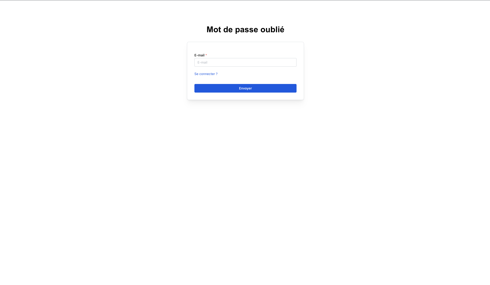
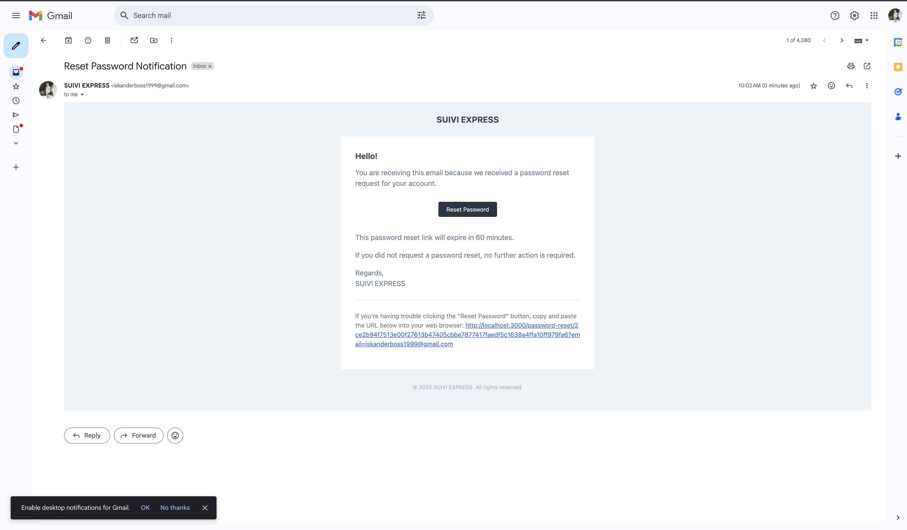
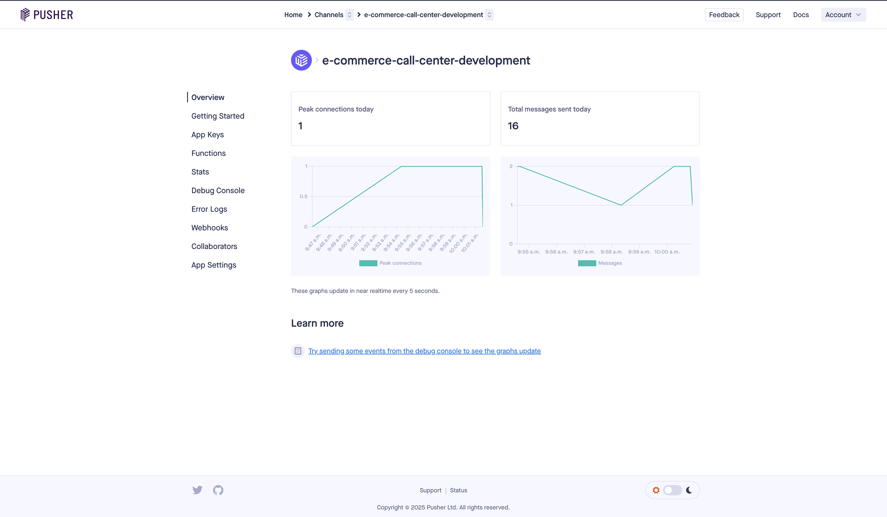
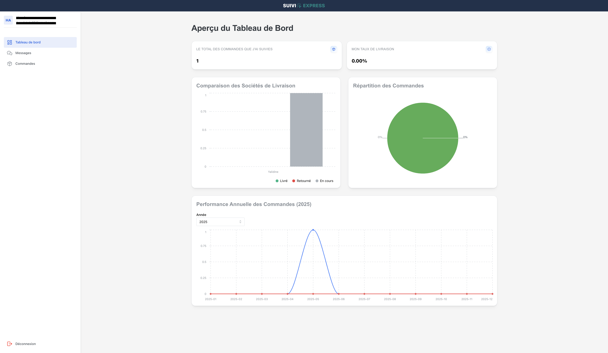
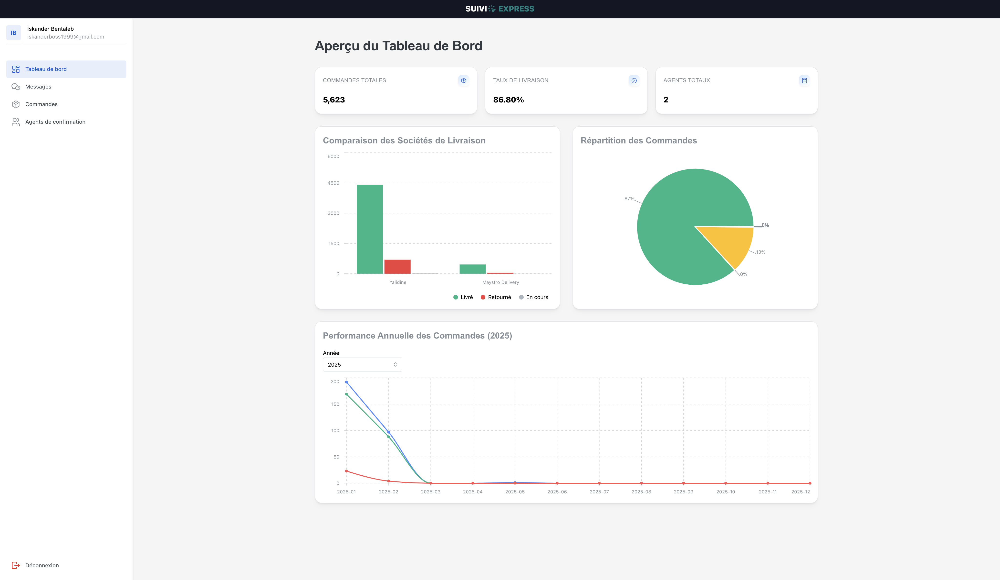
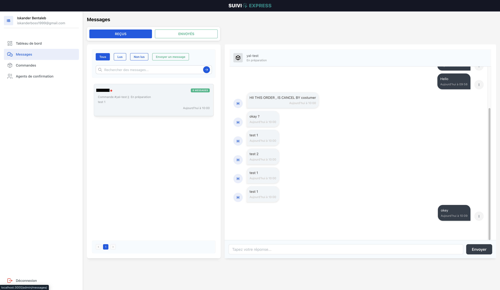
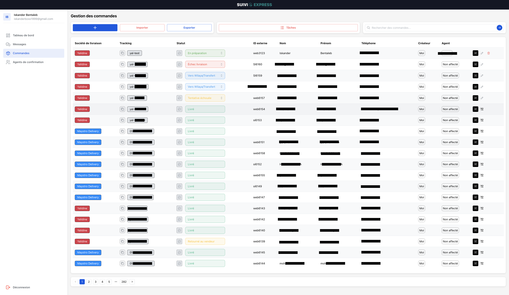
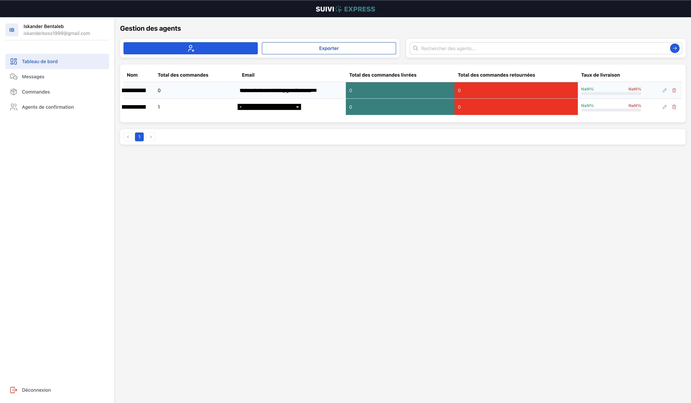
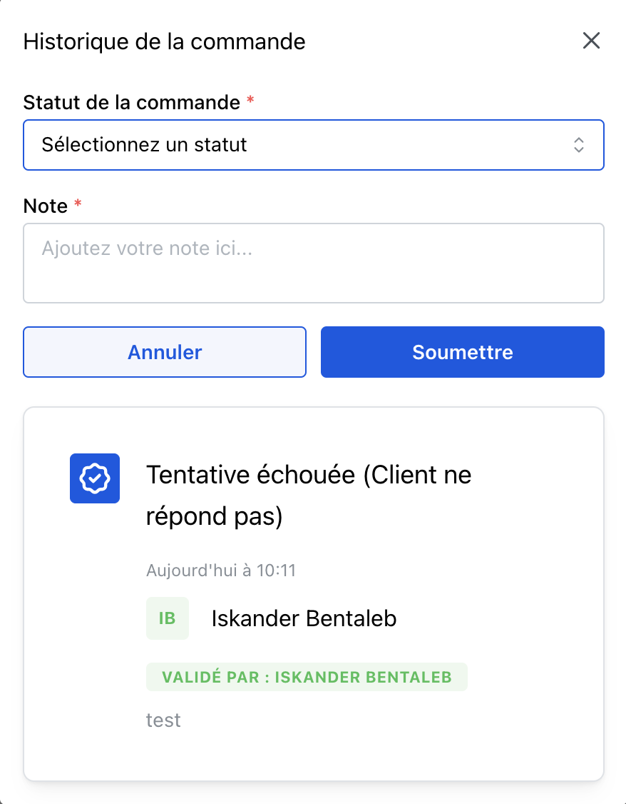

📦 E-Commerce Call Center System
This project is built with Laravel and MySQL for the backend, and React.js for the frontend. It’s designed to manage parcel tracking efficiently after handing over packages to delivery companies.

🔐 User Roles
There are two user roles:

Admin

Agent de Suivi (Tracking Agent)

Both use the same login form.

🚚 Key Features
Track parcel status updates in real-time from agents

Validate, archive, and manage parcels across multiple delivery companies

Import and export orders easily

Communicate with agents through a real-time messaging system powered by Pusher

Centralize parcel tracking in one dashboard

⚙️ Installation Instructions
Follow these steps to install and run the project on your local machine:

1. Clone the Repository
bash
Copy
Edit
git clone https://github.com/iskanderbentaleb/e-commerce-call-center.git
cd e-commerce-call-center
2. Install Backend Dependencies (Laravel)
bash
Copy
Edit
composer install
cp .env.example .env
php artisan key:generate
3. Set Up Environment Variables
Update your .env file with your database credentials.

Set up your Pusher credentials in .env:

ini
Copy
Edit
BROADCAST_DRIVER=pusher
PUSHER_APP_ID=your_app_id
PUSHER_APP_KEY=your_app_key
PUSHER_APP_SECRET=your_app_secret
PUSHER_APP_CLUSTER=your_cluster
4. Run Migrations
bash
Copy
Edit
php artisan migrate
5. Install Frontend Dependencies (React)
bash
Copy
Edit
npm install
6. Build the Frontend
bash
Copy
Edit
npm run dev
7. Run Laravel Server
bash
Copy
Edit
php artisan serve
